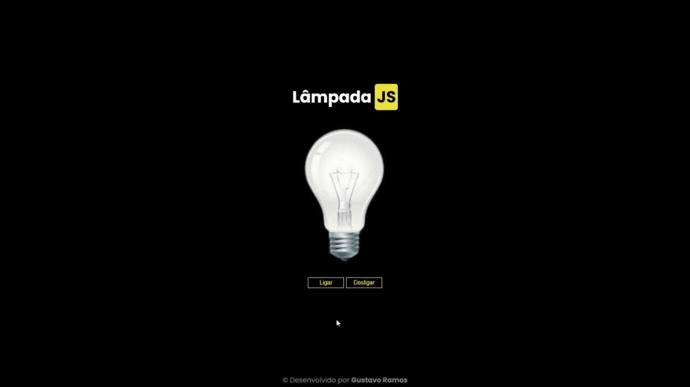

# Lâmpada JS

Projeto de uma lâmpada interativa desenvolvido com HTML, CSS e JavaScript puro (Vanilla JS).

## Tecnologias

- HTML5
- CSS3
- JavaScript
- Manipulação do DOM
- addEventListener
- Eventos de clique
- Funções com parâmetros
- Estruturas condicionais

## Demo

## Autor

Gustavo Ramos